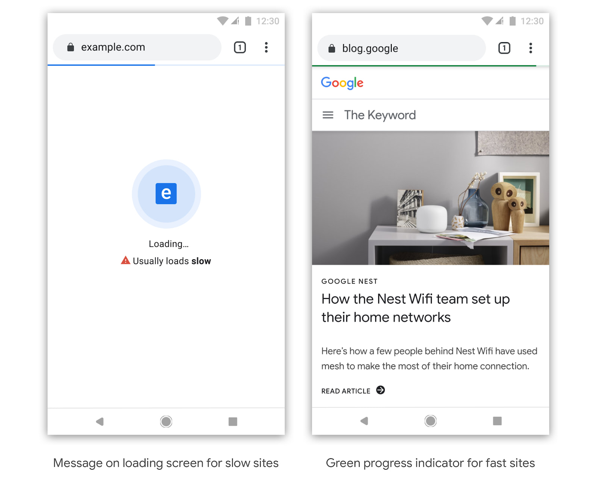

# <i class="fas fa-user-astronaut"></i> Acerca de mi <!-- .slide: class="" -->


## Anibal Sanchez <!-- .slide: class="who " data-background-repeat="no-repeat" data-background-image="images/05-who/anibal-0612-200.jpg" data-background-size="auto auto" data-background-position="95% 5%" -->

- Team Leader / Senior Dev, <svg xmlns="http://www.w3.org/2000/svg" viewBox="0 0 270.933 270.933" height="38" width="38"><path d="M0 0h270.933v270.933H0z" fill="none"/><path d="M225.778 129.822h-16.933V84.667c0-12.418-10.16-22.578-22.578-22.578H141.11V45.156c0-15.58-12.643-28.223-28.222-28.223S84.667 29.577 84.667 45.156v16.933H39.51c-12.418 0-22.465 10.16-22.465 22.578v42.897h16.82c16.821 0 30.48 13.66 30.48 30.48s-13.659 30.48-30.48 30.48H16.934v42.898c0 12.418 10.16 22.578 22.578 22.578H82.41v-16.933c0-16.82 13.66-30.48 30.48-30.48s30.48 13.66 30.48 30.48V254h42.898c12.418 0 22.578-10.16 22.578-22.578v-45.155h16.933c15.579 0 28.222-12.644 28.222-28.223 0-15.578-12.643-28.222-28.222-28.222z" fill="#ff8900"/></svg> [Extly Tech](http://extly-tech.com/)
  - Servicios de Consultoría para Soluciones Web<!-- .element: class="small" -->
  - DevOps On Arquitecturas Full-Stack<!-- .element: class="small" -->
  - Desarrollo de productos/servicios de software<!-- .element: class="small" -->
- +15 años en la industria de Internet
- Team Leader, <svg xmlns="http://www.w3.org/2000/svg" viewBox="0 0 15.665 15.645" height="38" width="38"><path class="ps01" d="M2.822 7.894l-.3-.3a3.471 3.471 0 0 1-.87-3.454 2.097 2.097 0 1 1 2.531-2.384 3.468 3.468 0 0 1 3.25.925l.12.12-1.546 1.546-.12-.12a1.288 1.288 0 0 0-1.82 1.82l.302.302 1.547 1.545 1.636 1.635-1.545 1.546L4.369 9.44 2.823 7.894" font-size="14" font-family="fnt0,HelveticaLTStd,Arial" letter-spacing="0" word-spacing="0" fill="#86be3c"/><path class="ps09" d="M4.552 6.166L6.19 4.53l1.547-1.545.302-.301a3.472 3.472 0 0 1 3.436-.878 2.096 2.096 0 1 1 2.352 2.367 3.472 3.472 0 0 1-.881 3.417l-.12.121-1.546-1.547.12-.12A1.283 1.283 0 0 0 9.583 4.23l-.303.302-1.546 1.546L6.099 7.71 4.552 6.166" font-size="14" font-family="fnt0,HelveticaLTStd,Arial" letter-spacing="0" word-spacing="0" fill="#e4b645"/><path class="ps04" d="M11.516 13.968a3.47 3.47 0 0 1-3.478-.863l-.119-.118 1.546-1.547.118.119a1.283 1.283 0 1 0 1.815-1.816l-.302-.302-1.545-1.547L7.918 6.26l1.547-1.546 1.631 1.634 1.545 1.546.304.304a3.47 3.47 0 0 1 .92 3.277 2.096 2.096 0 1 1-2.35 2.493" font-size="14" font-family="fnt0,HelveticaLTStd,Arial" letter-spacing="0" word-spacing="0" fill="#c33734"/><path class="ps010" d="M10.913 9.624l-1.631 1.633-1.546 1.547-.303.303a3.469 3.469 0 0 1-3.295.913A2.097 2.097 0 0 1 0 13.55c0-.99.688-1.821 1.612-2.04a3.47 3.47 0 0 1 .91-3.315l.117-.118 1.547 1.546-.12.119a1.288 1.288 0 0 0 1.82 1.82l.303-.304 1.546-1.546 1.633-1.635 1.545 1.547" font-size="14" font-family="fnt0,HelveticaLTStd,Arial" letter-spacing="0" word-spacing="0" fill="#748ec4"/></svg> [Joomla! Extensions Directory](https://extensions.joomla.org/)

<i class="far fa-id-card"></i> [@anibal_sanchez](https://twitter.com/anibal_sanchez) - anibal.sanchez[@]extly.com


## <i class="fas fa-code"></i> Mis Palabras Tech de Hoy

```

    {
        Joomla(3) => Joomla(4);
        Tailwind();
        Laravel();
        Vue();
        DesarrolloMovíl() => Web + Mobile_Apps + WebApps;
        DesarrolloModerno() => PHP_7/8 + Javascript_ESNext;
    }

```


## Avanzando hacia una web más rápida <i class="fas fa-bolt"></i>

 <!-- .element: style="width: 50%" -->

_... En el futuro, [Chrome puede identificar sitios que normalmente cargan rápido o lento](https://blog.chromium.org/2019/11/moving-towards-faster-web.html)... Nuestro plan para identificar los sitios que son rápidos o lentos se llevará a cabo en pasos graduales, basados en criterios cada vez más estrictos. (11/11/2019 - Chromium Blog)_<!-- .element: class="small" -->


<!-- .slide: data-background-repeat="no-repeat" data-background-image="images/05-who/mobile-phone_1024.jpg" -->

<p style="margin-top:12em;color:#fff;">Los dispositivos móviles generan el <b>80% del uso global de Internet</b>.</p>


<!-- .slide: data-background-repeat="no-repeat" data-background-image="images/05-who/mobile-phone_1024.jpg" -->

<p style="margin-top:12em;color:#fff;">El <b>48% de los compradores</b> utilizan dispositivos móviles para comenzar a buscar.</p>


<!-- .slide: data-background-repeat="no-repeat" data-background-image="images/05-who/mobile-phone_1024.jpg" -->

<p style="margin-top:12em;color:#fff;">El 69% de los <b>consumidores de entre 18 y 39</b> usan dispositivos móviles para investigar productos antes de comprar.</p>


<!-- .slide: data-background-repeat="no-repeat" data-background-image="images/05-who/mobile-phone_1024.jpg" -->

<p style="margin-top:12em;color:#fff;">El 78% de las búsquedas de <b>un negocio local</b> desde un dispositivo móvil dan como resultado una compra.</p>


<!-- .slide: data-background-repeat="no-repeat" data-background-image="images/05-who/JED-instant-search-algolia.png" data-background-size="50% auto" data-background-position="50% 20%" -->

<p style="margin-top:12em">Más allá de la búsqueda <i class="fas fa-search-dollar"></i><br><strong>Experiencias de descubrimiento instantáneas, sin fricciones, y con contenido global relevante</strong></p>


<!-- .slide: data-background-repeat="no-repeat" data-background-image="images/10-what/jed-search-InstantSearch.png" data-background-size="50% auto" data-background-position="50% 20%" -->


<!-- .slide: data-background-repeat="no-repeat" data-background-image="images/05-who/algolia-jed-facebook.png" data-background-size="auto auto" data-background-position="50% 20%" -->

<p style="margin-top:14em;">... acabo de descubrir las nuevas opciones de filtrado en el JED! Esto es <a href="https://www.facebook.com/groups/joomlanospam/permalink/10156343997875997/">asombroso</a> 🙌😊👏</strong></p>
