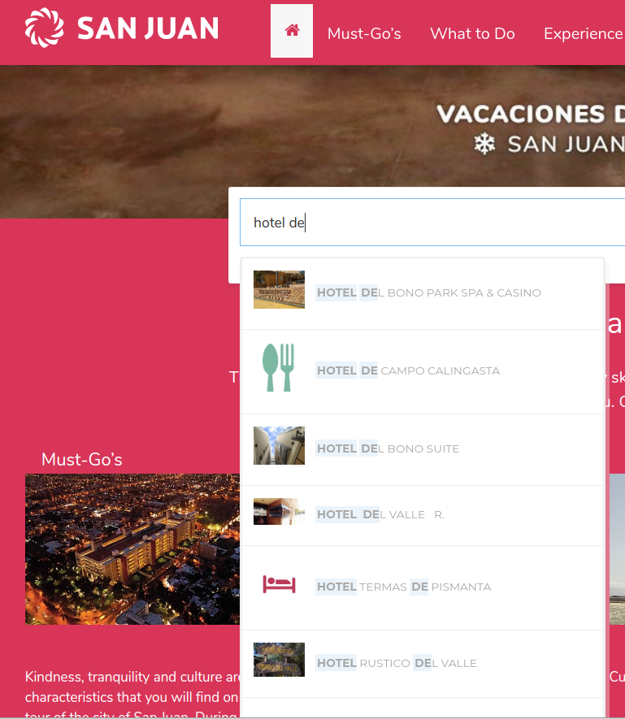
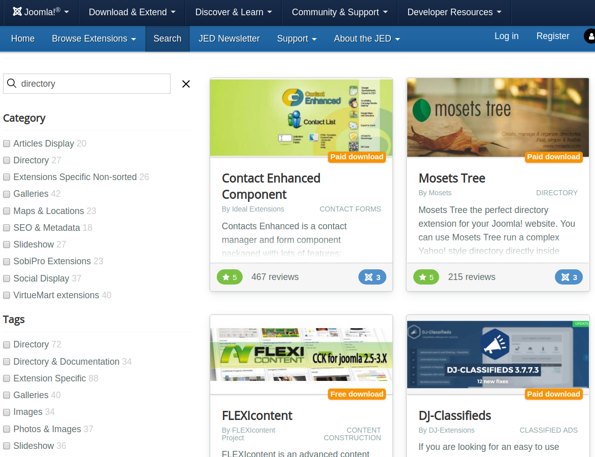
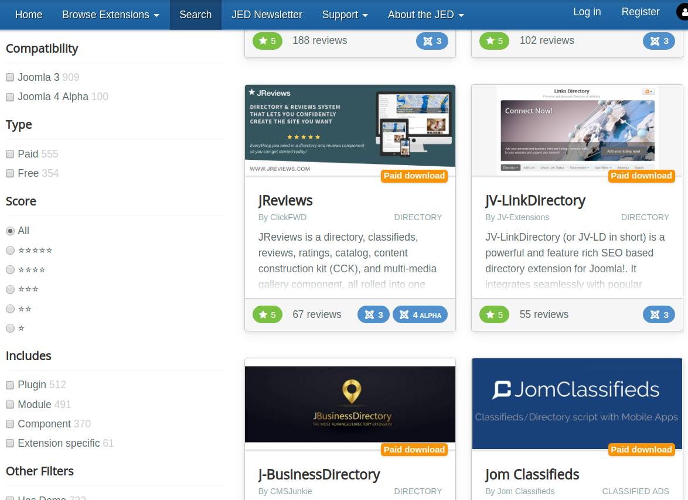
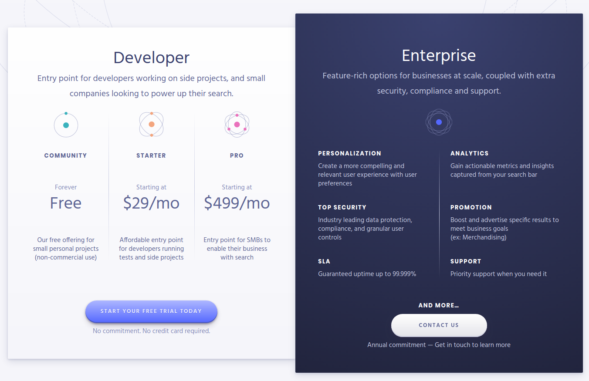
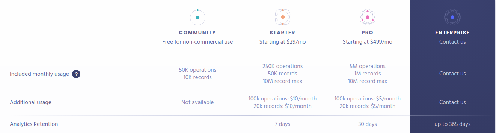

# ¿Qué es Algolia?  <!-- .slide: class="" -->

 <!-- .element: style="width: 10%" -->

- Un motor de búsqueda gestionado de texto completo, numérico y facetado<!-- .element: class="small" -->
- Capaz de entregar resultados en tiempo real desde el primer tipeo<!-- .element: class="small" -->
- Ofrece productos/ servicios para acelerar las búsquedas<!-- .element: class="small" -->
- Potencia las experiencias de descubrimiento en cualquier dispositivo y plataforma<!-- .element: class="small" -->
- Basado en una red global de entrega de búsquedas<!-- .element: class="small" -->

## 1. La búsqueda importa <i class="fas fa-search-dollar"></i> <!-- .slide: class=" plain" -->

- Una mala búsqueda cuesta muy caro
- Los usuarios recuerdan las malas experiencias de búsqueda
- Una gran búsqueda produce resultados de negocio

## 2. Intención del usuario <!-- .slide: class=" plain" -->

_"búsqueda más allá del buscador"_

- Cubriendo lo básico
    - Relevancia textual
    - Relevancia comercial
    - Personalización
- Experiencia de usuario: casos de uso avanzados

## Casos de éxito

### Casos de éxito

[sanjuan.tur.ar](https://sanjuan.tur.ar/en/)

- Búsqueda multilingüe <!-- .element: class="small" -->
- Búsqueda por auto-completado <!--.element: class="small" -->
- Búsqueda avanzada instantánea  <!--.element: class="small" -->
- Indexando de Artículos K2 y Directorio SobiPro<!-- .element: class="small" -->
- Soporte de la segmentación de la búsqueda por alcances e idiomas <!-- .element: class="small" -->

Potenciado por [XT Search for Algolia](https://www.extly.com/xt-search-for-joomla.html)

## Búsqueda por auto-completado

## Directorio de Extensiones Joomla

 <!-- .element: style="width: 10%" -->

[extensions.joomla.org](https://extensions.joomla.org)

- Búsqueda de texto completo para una extensión propia<!-- .element: class="small" -->
- Búsqueda por auto-completado<!-- .element: class="small" -->
- InstantSearch Avanzada<!-- .element: class="small" -->
Soportado por un complejo sistema de clasificación y ordemiento<!-- .element: class="small" -->

## Instant Search

## InstantSearch - Campos & Facetas

## El Valor <i class="fas fa-dollar-sign"></i> de Algolia

 <!-- .element: style="width: 90%" -->

## El Valor <i class="fas fa-dollar-sign"></i> de Algolia

 <!-- .element: style="width: 90%" -->
